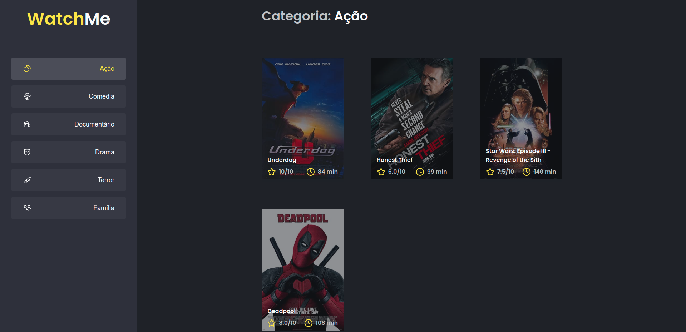
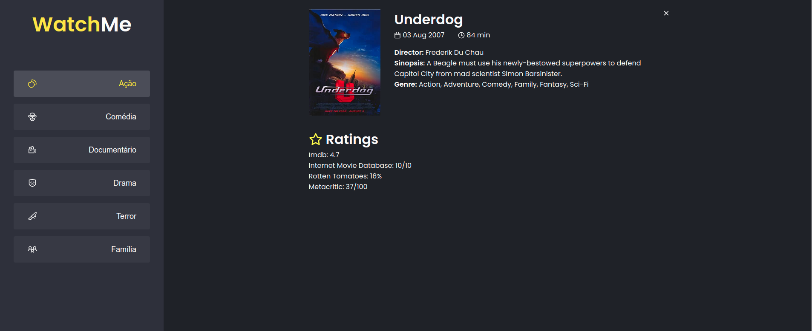

# Componentizando a aplicação

Este projeto foi desenvolvido no desafio #02 do curso de Reactjs da Rocketseat. O projeto consiste em um guia de filmes categorizados por uma lista de generos. Como adicional, eu acrescentei um componente que exibe todas as informações do filme ao serem clicados.




# Installation

You'll need NPM to install this application.

Open your bash and run:

```bash
git clone https://github.com/mat-alcantara/ignite-componentizando-a-aplicacao.git componentizando-a-aplicacao
```

```bash
cd componentizando-a-aplicacao
```

```bash
npm run install
```

## Usage

First you need to load the api

```bash
npm run server
```

Then start the application

```bash
npm run dev
```

## Contributing

Pull requests are welcome. For major changes, please open an issue first to discuss what you would like to change.

Please make sure to update tests as appropriate.

## License

[MIT](https://choosealicense.com/licenses/mit/)
